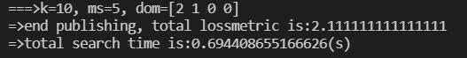

# k匿名两种算法的python实现

姓名：于子健

学号：PB18000379

[TOC]

## 环境

这里由于没有使用conda建立虚拟环境，也没有使用dpkg发布（懒），所以使用者需要自己额外安装所需依赖库；

所需依赖以及测试环境具体版本如下：

- python (3.6.9)
- numpy (1.19.5)
- pandas (1.1.5)

## 简介

本仓库实现了k匿名的samarati算法和mondrian算法，做成了即拆即用、适用性强的python模块；下面是两种算法的简介和Quick Startup。

### k匿名

预定义待发布的隐私属性S、Quasi-identifiers属性QI，通过对QI属性在数据集中出现的实例进行一定程度的泛化(Generalization)，达成如下效果，称为使数据集满足k匿名：

按照QI属性的每一种实例组合，对数据集进行分组，每个QI cluster中所包含的元组tuples的个数不小于k。

### samarati算法

1. 技术：

   - Generalization：泛化；参照一定的树形结构，将QI属性的实例做多对一映射，相当于对QI cluster做了聚集。
   - Suppression：不发布，删除；即进行一定泛化操作后，若仍有不满足k匿名的QI cluster，则不发布这些QI cluster所含的所有tuples（即这些数据不会出现在最后发布的数据集中，即删除这些数据）。

2. 准备：

   - 给定数据集、数据集属性名attributes、QI、S、匿名数k、最大不发布tuple数ms；

   - 给定各个QI cluster泛化需要参照的树形结构的子->父关系，使得能通过这样的结构对数据集中的QI属性做泛化。

3. 基本过程：

   维护一个len(QI)维的向量dom，用于表示当前各QI泛化到树形结构对应的哪一层了（这里为了程序的可用性，使用了full domain型泛化方式）；对向量dom形成的向量空间做快速二分搜索，搜索得一个泛化后满足k匿名和ms的最大不发布个数，并且dom各元素求和最大的向量dom（泛化到树形结构越高层，越容易满足k匿名）。

### mondrian算法

1. 技术：

   - Generalization：泛化；
   - Priority Queue：优先队列（最大），队列元素[key,value]按照key有优先级，队头一定是优先级最高的，用于代替递归。

2. 准备：

   - 给定数据集、数据集属性名attributes、QI、S、匿名数k；
   - 初始化最大优先队列为单一元素，key是数据集中tuples数 ，value是整个数据集，代表“将整个数据集泛化成一个QI cluster”。

3. 基本过程：循环：

   每次循环，对最大的QI cluster单独选择一个属性（可以选择范围最大的属性或者随机选），找到属性的中位数，对Partition划分；

   重复上述过程，直到不能划分（当前最大的QI cluster的大小在[k,2k)区间内）为止。

### Quick Startup

代码实现了一个基于python3的模块k_anonymity，使用时仅需要引入该模块，定义所需使用的算法对象，执行算法即可。

1. 准备：

   - 待处理的数据集（目前仅支持.data等csv类型）；
   - 若欲使用samarati算法，需要在数据集同一文件夹下，放置树形结构.txt文件；树形结构.txt文件中，是按照“子,父”的模式描述树形结构的；
   - 需要将调用模块的python脚本跟模块文件夹k_anonymity置于同一父文件夹下，或需要将k_anonymity模块的路径加入环境变量；
   - 最后发布的数据集也会放到与数据集相同的父文件夹下。

2. 使用：

   使用方法见如下示例代码：

   [samarati](./test1.py)：

   ```python
   from sys import argv	# 脚本参数
   import k_anonymity		# 引入模块
   # Begin:预定义path、attributes、QI、S等参数
   script, path, k, ms = argv[0], argv[1], argv[2], argv[3]
   # 注：path可以是相对路径如./data/adult.data，但是要确保树形结构的文件与data文件在同一文件夹下
   attributes = ['age', 'work_class', 'final_weight', 'education',
                 'education_num', 'marital_status', 'occupation', 'relationship',
                 'race', 'gender', 'capital_gain', 'capital_loss', 'hours_per_week',
                 'native_country', 'class']
   QI = ['age', 'gender', 'race', 'marital_status']
   S = ['occupation']
   # End:预定义
   # Begin:samarati
   s = k_anonymity.samarati(path,int(k),int(ms),attributes,QI,S)		# 定义算法对象
   s.build_tree()														# 读入并创建树形结构
   s.search()															# 做samarati搜索，并发布数据
   # Ended:samarati
   ```

   [mondrian](./test2.py)：

   ```python
   from sys import argv	# 脚本参数
   import k_anonymity		# 引入模块
   # Begin:预定义path、attributes、QI、S等参数
   script, path, k = argv[0], argv[1], argv[2]
   attributes = ['age', 'work_class', 'final_weight', 'education',
                 'education_num', 'marital_status', 'occupation', 'relationship',
                 'race', 'gender', 'capital_gain', 'capital_loss', 'hours_per_week',
                 'native_country', 'class']
   QI = ['age', 'gender', 'race', 'marital_status']
   S = ['occupation']
   # End:预定义
   # Begin:mondrian
   m = k_anonymity.mondrian(path, int(k), attributes, QI, S)			# 定义算法对象
   m.search()															# 做mondrian划分，并发布数据
   # End:mondrian
   ```

## 细节

实现思路以及模块细节如下：

### 实现思路

1. load：

   - 读出数据：使用pandas读出数据成为dataframe型
   - 去除数据集中所有含'?'的tuple：将dataframe中所有'?'都用numpy.nan代替，然后使用pandas.dataframe.dropna()方法统一去除。

2. samarati：

   - 自己定义一个类MyTree：

     用于存储读入的树形结构，并基于树构造好一些类变量（如树高到泛化字典的映射、树节点到Loss Metric值得映射等）方便做泛化和Loss Metric计算；

   - 使用load方法读入并清洗数据，作为原始数据；

   - 维护一个dataframe型类变量count：

     是对原始数据按照QI属性的实例组合做分组聚集并count的结果，列属性有QI+'num'，一行即为一个初始QI cluster；

     使用对count的泛化来代替对原始数据的泛化，方便做泛化向量空间的搜索和对某一泛化向量判断k匿名；

   - 判断某一泛化向量dom是否满足不发布数为ms的k匿名：

     使用dom索引泛化结构树中的相关类变量，基于这些变量，对深拷贝后一个新的count做泛化、分组、sum聚集，判断聚集后的、'num'属性小于k的QI cluster的'num'和是否大于ms，若小于则满足k匿名；

   - 计算某一泛化后的count的Loss Metric：

     将QI属性的实例值，使用泛化结构树的类变量，映射成为对应的Loss Metric值；乘上各QI cluster的'num'值后，按照tuple取平均，得到LM值；

   - 泛化向量dom的向量空间搜索：

     - 先快速搜索，整体二分；

     - 再对dom的和做二分，找到和尽可能大的dom：

       使用递归，dfs总和相同的所有dom的情况并逐一判断；

     - 最后对搜得的最优dom和，寻找其中Loss Metric最优的解（选做部分）

   - 根据搜索得到的结果dom做数据发布：

     类似地重复一遍判断k匿名的工作即可完成泛化和删除，最后使用pandas的to_csv方法即可将数据导入到文件。

3. mondrian：

   - 自己定义一个类MyPriorityQueue：

     是二叉堆实现的（最大）优先队列，能根据传入的优先级函数，判断key的优先级并维护value的优先级；队头永远是优先级最高的那个；

   - 使用load方法读入并清洗数据，作为原始数据；

   - 初始化最大优先队列为单一元素，key是数据集中tuples数 ，value是整个数据集，代表“将整个数据集泛化成一个QI cluster”；

     循环：

     每次循环dequeue取出队头的元素（即当前tuple数目最多的QI cluster）。

     首先对该元素，随机选择一个QI属性，做中位数划分（strict partitioning），得到两个可能不均匀的、互补的子集；若两子集都满足k匿名，则将两个子集都enqueue入队，value值仍为它们的tuples数目；否则看本次取出的队头元素大小是否不小于2k（即该QI cluster能否均匀中位数划分成为两个都满足k匿名的子集），若能则做划分，得到子集入队，否则划分结束，break跳出循环。

   - 划分结束后对原数据做泛化、计算LM，并发布：

     - 泛化：

       循环取出队列中的元素，直到队列为空，每个元素代表最终的一个QI cluster；

       对每个取出的dataframe，取range=max-min，得到该QI cluster内每个QI属性的取值集合；

       由于做dataframe划分时，索引值未改变，根据取出的dataframe的索引，使用loc方法即可索引到对应的原数据tuples，在原数据中将实例替换成上面算出的区间str即可。

     - 计算LM：

       在上面描述的循环中一同计算：上面已经取出了区间值，很容易算得对应的LM。

     - 发布：同样使用pandas的to_csv方法，将数据导入到文件。

### 模块细节

下面是模块的各个函数接口介绍：

1. load.py：

   ```python
   def loaddata(path, attributes):
       '''从路径为path的.data文件中，按照列名attributes读入数据集成dataframe型，并去除空数据和'?'所在的行，返回所得数据'''
   ```

2. MyTree.py：

   ```python
   class MyTree:
       '''泛化树形结构的python3.6.9实现\\
       构建树的步骤：init -> add_relation*n -> build_h2node -> build_node2leaf -> build_isdigit -> (not digit)build_h2GeneralizationDict -> build_node2LM\\
       最终只剩下树高h、isdigit、h2node、高度到泛化字典的映射h2GeneralizationDict、node2LM这五个属性'''
   
       def __init__(self, name):
           self.name = name
           self.son2father = {}            # 子->父，一对一，建树用
           self.father2son = {}            # 父->子，一对多，建树用
           self.node = []                  # 结点列表，存储字符串，建树用
           self.h = 0                      # 树高(算边而不是算点，与PPT中不同，是为了方便使用列表映射h2node)
           self.h2node = []                # 高度->结点list
           self.node2leaf = {}             # 树节点映射到以他为根的子树的叶节点
           self.isdigit = False            # 树对应的QI是不是数值型
           self.h2GeneralizationDict = {}  # h映射到泛化重命名dict
           self.node2LM = {}               # 结点名映射到对应结构的LossMetric
   
       def add_relation(self, father, son):
           '''添加父子关系，father和son均为字符串'''
       def build_h2node(self):
           '''构建h2node映射，使得能通过h直接查询node集'''
       def build_isdigit(self):
           '''判断是否为数值型并返回'''
       def print_tree(self):
           '''打印树，测试用'''
       def build_node2leaf(self):
           '''构建node2leaf，使得能够直接查询以结点为根的子树的叶节点'''
       def nodes_in_h(self, h):
           '''用h查询对应高度的nodelist'''
       def build_h2GeneralizationDict(self):
           '''为非数值型的，创建树高h到对应的泛化字典的映射'''
       def build_node2LM(self):
           '''预先创建好node向Loss metric的映射，方便算LM评估'''
   ```

3. MyPriorityQueue.py：

   ```python
   class MyPriorityQueue:
       '''使用二叉堆的最小优先队列的python3.6.9实现，方便做A* search和Mondrian\\
           优先级函数f(a,b)返回"(a优先级比b高)?"'''
   
       def __init__(self, f):
           '''初始化最小优先队列为空，二元优先级函数为f(a,b)'''
           self.queue = []
           self.function = f
   
       def father(self, i):
           '''得到queue[i-1]在二叉堆中的父节点queue[j-1]的位置j'''
       def left(self, i):
           '''得到queue[i-1]在二叉堆中的左孩子queue[j-1]的位置j'''
       def right(self, i):
           '''得到queue[i-1]在二叉堆中的右孩子queue[j-1]的位置j'''
       def enqueue(self, key, value):
           '''入队，[key,value]'''
       def dequeue(self):
           '''出队，res=[key,value]'''
       def maintain(self, tag):
           '''维护最小优先队列性质，tag为1时下沉，为0时上浮'''
       def is_empty(self):
           '''判断并返回优先队列是否为空'''
       def empty(self):
           '''清空最小优先队列'''
       def test_queue(self):
           '''测试优先队列'''
   ```

4. samarati.py：k匿名的samarati算法实现

   ```python
   class samarati:
       '''
       k匿名的samarati算法实现\\
       初始化参数为：数据集路径path(str)、匿名参数k(int)、最大suppression的个数ms(int)、数据集列名attributes(list)、需处理的QI(list)、待发布的隐私属性S(list)
       '''
   
       def __init__(self, path, k, ms, attributes, QI, S):
           '''初始化：数据文件路径、k、ms、attributes、QI、S'''
           self.data = loaddata(
               path, attributes)                   # 将有效数据从路径为path的.data文件中，按照列名attributes加载出来，成dataframe型
           self.data = self.data[QI+S]
           self.path = path
           self.k = k
           self.QI = QI
           self.S = S
           self.attributes = attributes
           self.ms = ms
           self.tree = {}                          # QI->对应的泛化树形结构
           # 按照QI各个具体取值分组聚集计行数，方便后面统计一个cluster中的记录数判断k匿名；其中as_index=False表示不按照组标签作为索引，方便二次处理
           self.count = self.data.groupby(QI, as_index=False).count()
           # 去掉冗余属性
           self.count = self.count[(QI+S)[0:len(QI)+1]]
           rename = {S[0]: 'num'}
           # dcount列重命名，仅包含QI+num
           self.count.rename(columns=rename, inplace=True)
   
       def change_k(self, k_new):
           '''将参数k更改为k_new'''
       def change_ms(self, ms_new):
           '''将参数ms更改为ms_new'''
       def show_data(self):
           '''测试用，输出data'''
       def build_tree(self):
           '''根据各QI的树形结构文件创建树形结构
               注意，建树完成后，数值型的h是包含了泛化结构的最底层“不泛化”'''
       def show_tree(self):
           '''打印各个QI对应的泛化树，测试用'''
       def is_kanonymity(self, dom, do_evaluate):
           '''判别是否为k匿名\\
               其中dom为list型或ndarray数组，与self.QI对应，为收敛到第几层了\\
               而do_evaluate为布尔值，若为True时评估可用性损失并返回，否则返回的可用性损失为0'''
           # 用对self.count的泛化来模拟对数据集的泛化，简化了操作
       def pub_data(self, dom):
           '''将数据按照dom做泛化，并发布成.data文件，返回生成的文件名'''
       def multiply(self,x,y):
           '''自定义乘函数，用作计算Loss Metric的时候，按行处理\\
           y是QI cluster tuple number，x是属性对应的LM值'''
       def evaluate(self,count):
           '''LossMetric评价泛化后数据可用性损失：count为泛化后的QI cluster所有种类的num，构成的dataframe'''
       def permutation(self,h,i,dom):
           '''DFS，对剩余可用高度总和h、当前QI[i]、这一层的dom(np.array型)，递归判断“本层”构成的dom组合能否满足k匿名'''
       def find_opt(self, h, i, dom):
           '''搜索并返回第h层中LM最优的泛化结果dom'''
       def search(self):
           '''将数据做快速k匿名处理并发布成.data文件，返回生成的文件名'''
           # 快速求出一个可行解
           # 维护list，表示各QI已经泛化到第几层了
           # 快速搜解：整体二分
       def search_opt(self):
           '''将数据做最优(?)k匿名处理并发布成.data文件，返回生成的文件名'''
           # 搜索一个可用性尽可能高的解，考虑A*
           # 利用pub_data生成的可行解，在剩下的搜索中用该可行解做剪枝（使用LM衡量数据可用性）
           pass
   ```

5. mondrian.py：k匿名的mondrian算法实现

   ```python
   '''处理标签型的思路：将标签型一一映射成为整数，获得数值型；最后发布的时候，文件中存放整数与标签的对应关系'''
   def bigger(a,b):
       return a>b
   
   class mondrian:
       '''
       k匿名的Mondrian算法实现\\
       初始化参数为数据集路径path(str)、匿名参数k(int)、数据集列名attributes(list)、需处理的QI(list)、待发布的隐私属性S(list)
       '''
       def __init__(self, path, k, attributes, QI, S):
           '''初始化：数据文件路径、k、attributes、QI、S'''
           self.data = loaddata(
               path, attributes)                   # 将有效数据从路径为path的.data文件中，按照列名attributes加载出来，成dataframe型
           self.data = self.data[QI+S]
           self.path = path
           self.k = k
           self.QI = QI
           self.S = S
           self.attributes = attributes
           # 初始化最大优先队列为只加入总data，key为
           self.Queue = MyPriorityQueue(bigger)
           self.Queue.enqueue(self.data.count()[S[0]], self.data)
           # 标签型向数值型转化的dict
           self.categorical2numerical = {}
           self.build_categorical2numerical()
   
       def build_categorical2numerical(self):
       	'''数据预处理，将标签型转化成数值型'''
       def search(self):
           '''对读入的数据搜解，即将最大优先队列的最大key变得不大于k；优先队列中的每个都相当于一个QI cluster'''
       def pub_data(self):
           '''将数据按照Queue里的QI cluster做泛化，并发布成.data文件，同时计算并打印LossMetric，返回生成的文件名'''
   ```

## 测试

### 正确性测试

1. load：

   使用测试数据，测试数据集加载和清洗的正确性：

   

   上图展示的就是下面用到的测试数据，下面不再展示数据集加载过程。

2. samarati：

   使用测试数据，k=10、ms=20，测试编写的samarati算法的正确性：

   搜索过程：

   

   泛化、删除、算Loss Metric、发布过程：

   

3. mondrian：

   使用测试数据，k=10，测试编写的mondrian算法的正确性：

   切分dataframe的效果如下：

   

   可以看到切分并不会重置index，所以最后是能通过index索引到原数据的tuple的；

   搜索和泛化、发布数据的过程如下：

   

### 结果的分析、讨论

对相同的QI = ['age', 'gender', 'race', 'marital_status'], S = ['occupation']，变换不同的匿名属性值，观察结果的变化。

1. samarati：

   泛化向量dom与QI属性一一对应，为了显示出变化，这里没有均匀取点。

   - k=10，ms=20：

     

   - k=10，ms=5：

     

   - k=10，ms=50：

     

   - k=5，ms=20：

     

   - k=20，ms=20：

     

   观察：

   - 相同ms下，减小k相当于放松了k匿名的要求，因为需要更少地泛化就能使QI cluster中地tuple数目不小于k，相应解的LM会变小；增加k相当于缩紧了k匿名的要求，相应解的LM会变大。
   - 相同k下，增加ms相当于放松了k匿名的要求，因为能更多地通过suppression删除不满足k匿名的QI cluster，相应解的LM会变小；减小ms相当于缩紧了k匿名的要求，相应解的LM会变大。

2. mondrian：

   - k=5：

     

   - k=10：

     

   - k=20：

     

   观察：

   减小k相当于放松了k匿名的要求，因为需要更少地划分QI cluster，就能使QI cluster中地tuple数目不小于k，相应解的LM会变小；增加k相当于缩紧了k匿名的要求，相应解的LM会变大。

## 进阶

### 合理选择samarati的解

1. 基于samarati算法二分搜索所得的dom和：

   即使是dom和已经达到最优了，仍然可能有多个Loss Metric不同的解满足要求；

   在samarati算法的基础上，搜索得到最后的dom和后，遍历满足和等于该值的所有dom，取其中Loss Metric最小的作为最终发布数据所用dom；

   搜索过程如下：

   ```python
   def find_opt(self, h, i, dom):
           '''迭代搜索并返回第h层中LM最优的泛化结果dom'''
           qi = self.QI[i]             # 当前处理的qi
           QI_num = len(self.QI)       # QI总个数
           j = min(h, self.tree[qi].h) # 迭代用，从允许的最大的开始迭代
           j_end = 0
           k = i+1
           while k<QI_num:
               j_end = j_end + self.tree[self.QI[k]].h
               k = k+1
           j_end = max(0, h-j_end)     # 迭代用，j允许的最小值
           while(j>=j_end):
               # 通过对dom[i]的修改，对可能的情况做遍历
               if(i != QI_num-1):
                   # 不是最后一个qi，则对下一个qi递归做判断
                   dom[i] = j
                   h_new = h - j
                   i_new = i + 1
                   self.find_opt(h_new,i_new,dom)
               else:
                   # 是最后一个qi
                   if(h <= self.tree[qi].h):
                       # 符合求和等于给定值的要求
                       dom[i] = h
                       res = self.is_kanonymity(dom,True)
                       if(res[0]):
                           # 为满足k匿名的解，以Loss Metric为key加入最小优先队列中
                           self.Queue.enqueue(res[1], copy.deepcopy(dom))
               j = j - 1
   ```

2. 对不同的QI属性，选用不同的评价指标：

   - 一个很简单的例子，假如在实现samarati算法的时候，并不对标签型属性和数值型属性加以区分，统一视作标签型属性来处理，此时计算数值型属性的Loss Metric时，就很可能不准（因为若一个泛化区间对应多个实例，若视作标签型，需要按照LM=(泛化到该值的实例种类数-1)/(实例种类总数-1)来计算，但是这样并不能很好地评估数据可用性损失）；
   - 本仓库在实现samarati算法时，特别地对数值型QI属性和标签型QI属性加以区分，以更好地计算Loss Metric值；同时对将要被suppress的数据，在计算各属性Loss Metric时，统一视为1，以使得最后算得的Loss Metric更能反映数据可用性损失的真实情况。
   - 此外，还可以考虑针对性地对不同的属性采用不同的可用性评价方法；但这时候就需要考虑属性的语义以便加以区分，本仓库为了方法对不同数据的适用性，并没有特别实现这一点。

3. 使用其它方法搜索泛化向量的状态空间：

   本仓库并没有实现这一点，但是进行了相应思考以及实现的准备和思考（虽然很明显下面的方法效率并不咋地）。

   如基于已经实现的优先队列，我们可以对状态空间，在BFS graph search框架下，做A* Search；启发式函数可以选用（起点的LM值-当前结点的LM值+两结点之间的间距），向量间距用向量差的模长表示；能证明若状态空间很大，可以很有效地搜索得到可用性较好的满足k匿名的解。

### Mondrian算法处理categorical

可以考虑将标签型属性在原始数据集中的取值实例集合，一一映射到连续的整数集合上，使得标签型属性变成数值型属性；

最后在发布泛化后数据时，将该属性的整数与标签的对应关系也一并发布出去；

本仓库给出了一个实现，同时简单地进行了测试：

```python
def build_categorical2numerical(self):
    '''数据预处理，将标签型转化成数值型'''
    for qi in self.QI:
        print(self.data[qi].dtypes)
        if self.data[qi].dtypes == object:
            # 是标签型，则将标签型映射成为整数
            vals = np.array(self.data[qi].drop_duplicates())
            rename = {}
            i = 0
            while i < len(vals):
                rename[vals[i]] = i
                i = i + 1
            self.data[qi] = self.data[qi].map(rename)
            self.categorical2numerical[qi] = rename
```

上面是在读入数据之后，进行预处理，将标签型映射成整数；而同时，映射关系会被保存成dict型对象，在数据发布时一同发布成yaml文件，在同一父文件夹下。

测试QI=['age', 'gender']，k=10，测试结果如下：


可以看到对categorical型QI属性gender成功进行了映射，并且成功做了mondrian切分。最后发布的yaml映射关系如下：


本方法的劣势也是十分明显，在做映射时，并未考虑标签之间的语义关系，即数值上相邻并不代表标签在语义上相邻；最后得到的结果可能并不太好看。